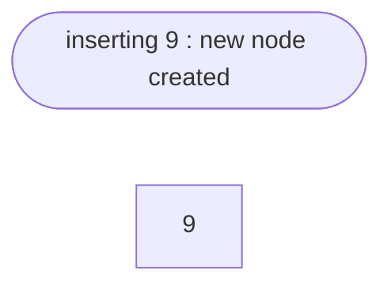
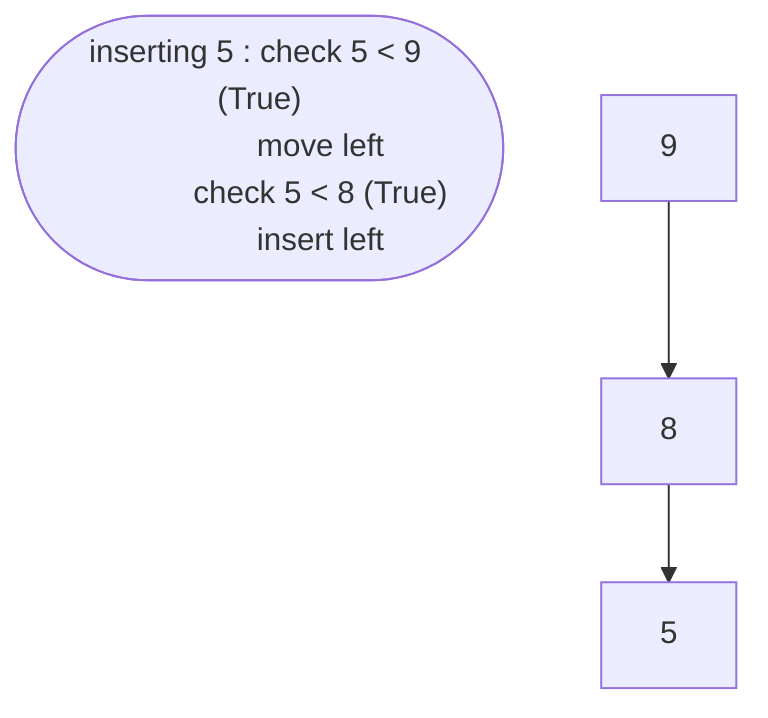
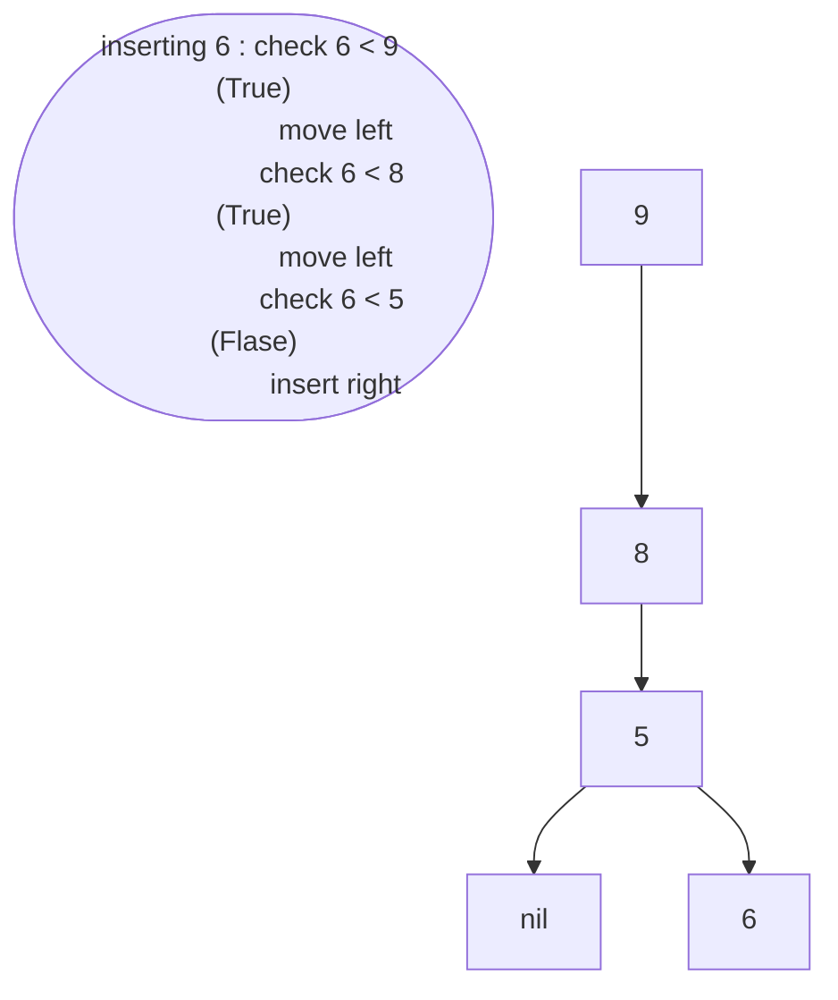

# Binary Search Tree
Binary search tree is a special case of binary tree where left child
values have to be smaller than the root and the right child values have
to be graeter than the root.

Let's insert values 9,8,5,6,19,4 to a Binary Search Tree


```mermaid
graph TD
note(["inserting 8 : check 8 < 9 (False) \n insert left]")
A[9] --> B[8]
```





### Restrictions:
- Each node can have either 0,1 or 2 childrens
- All child nodes are binary tree
- The values in the left sub-tree are smaller than the root
- The values in the right sub-tree are greater than the root

### Code
```python
# h3avren

class Node:
    def __init__(self,value):
        self.data = value
        self.left = None
        self.right = None

    def insert(self,value):
        if(value<=self.data):
            if(self.left):
                self.left.insert(value)
            else:
                self.left = Node(value)
        else:
            if(self.right):
                self.right.insert(value)
            else:
                self.right = Node(value)

    def traverse(self):
        if(self.left):
            self.left.traverse()
        print(self.data)
        if(self.right):
            self.right.traverse()

    def search(self,value):
        if(self.data == value):
            print(value, "is in the tree..!")
        else:
            if(value < self.data):
                if(self.left == None):
                    print(value, "not in the tree..!")
                    return
                self.left.search(value)
            else:
                if(self.right == None):
                    print(value,"not in the tree..!")
                    return
                self.right.search(value)
    
    def delete(self,value,prev = None):
        if(self.data == value):
            if(self.left):
                if(self.left.right):
                    prev = self.left
                    temp = self.left.right
                    while(temp.right != None):
                        prev = temp
                        temp = temp.right
                    prev.right = None
                    temp.left = self.left
                    temp.right = self.right
                    self.left = None
                    self.right = None
                    print(self.data, "deleted..!")
                    del self
                    return temp
                else:
                    self.left.right = self.right
                    temp = self.left
                    self.left = None
                    self.right = None
                    if(prev):
                        if(prev.left == self):
                            prev.left = temp
                        else:
                            prev.right = temp
                    print(self.data, "deleted..!")
                    del self
                    return temp
            elif(self.right):
                temp = self.right
                self.right = None
                if(prev):
                    if(prev.left == self):
                        prev.left = temp
                    else:
                        prev.right = temp
                print(self.data, "deleted..!")
                del self
                return temp
            else:
                if(prev.left == self):
                    prev.left = None
                else:
                    prev.right = None
                print(self.data, "deleted..!")
                del self
        else:
            prev = self
            if(value < self.data):
                if(self.left == None):
                    print(value,"not in the tree..!")
                else:
                    self.left.delete(value,prev)
                return self
            else:
                if(self.right == None):
                    print(value,"not in the tree..!")
                else:
                    self.right.delete(value,prev)
                return self

obj = Node(90)
obj.insert(100)
obj.insert(70)
obj.insert(80)
obj.insert(60)
obj.insert(110)
obj.insert(98)

try:
    obj.traverse()
except AttributeError:
    print("Tree is empty..!")
```

