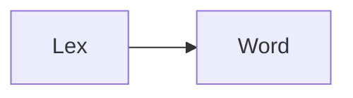
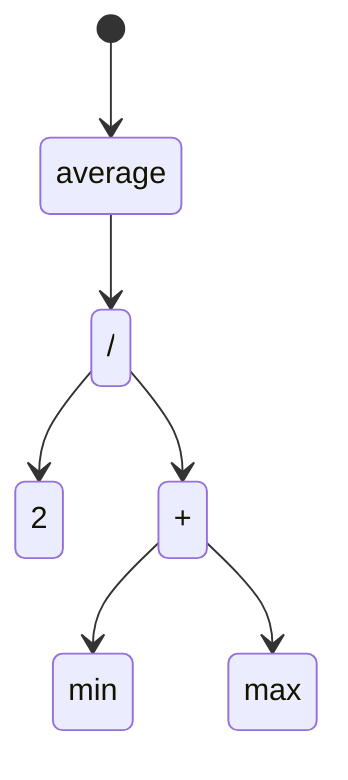

# Compilers

A compiler reads fliles in one language, translates them and outputs file in another language.
- We can implement a compiler in any language, including the same language it compiles (self-hositng)
- We can't compile our compiler using itself yet, but if we have another compiler for our language written
  in some other language, we use that one to compile our compiler once. Now, we can use the compiled
  versioin of our own compiler to compile future versions of itself and we can discard the original one
  compiled from the other compiler. This is called **_bootstrapping_**.
  
## Phases Of A Compiler

### Scanning
Also known as lexing or lexical analysis.

A scanner takes in linear stream of characters and chunks them together into a series of something more akin to "words".
In programming languages, each of these words is called a token.

`var` `average` `=` `(` `min` `+` `max` `)` `/` `2` `;`

### Parsing
This is where our syntax gets a grammar - The ability to compose larger expressions and statements out of smaller parts.
A parser takes the flat squence of tokens and builds a tree structure that mirrors the nested nature of the grammar.
These are called **parse trees** or **abstract syntax trees**.

Parser also reports **syntax errors**.

### Static Analysis
Binding or reolution is the first type of analysis most languages do. For each identifier we find out where that name is defined and wire the two together.
Scope (the region of source code where a certain name can be used to refer to a certain declaration) checking is done in this very phase.

Statically typed languages also does type checking.
- The analysed code and be stored in AST as attributes.
- Data can also be stored in look-up table with identifiers as keys. This table is also called a symbol table.

### Intermediate Representation
The front end of the pipeline is specific to the source language the program is written in. The back end is concerned with the final architecture where the
program will run.
There are multiple ways to represent intermediate code:
- Three address code
- Control flow graph
- Static single assignment
- Continuation passing style

### Optimization
Swapping the users program with a different program that has the same semantics but implements them more efficiently is called optimization.
Techniques:
- Constant Folding
- Constant Propagation
- Common Subexpression Elimination
- Loop Invariant Code Motion
- Global Value Numbering
- Strength Reduction
- Scalar Replacement Of Aggregates
- Dead Code Elimination
- Loop Unrolling

