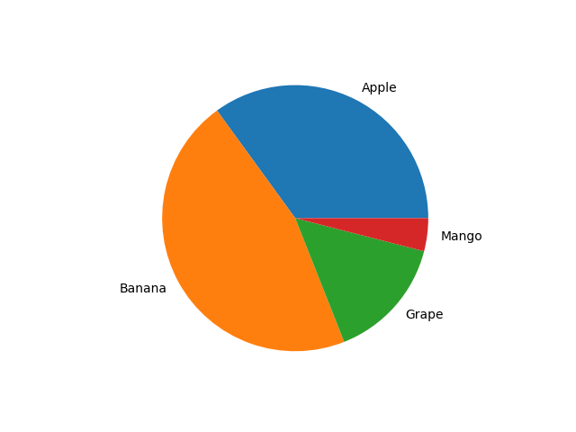
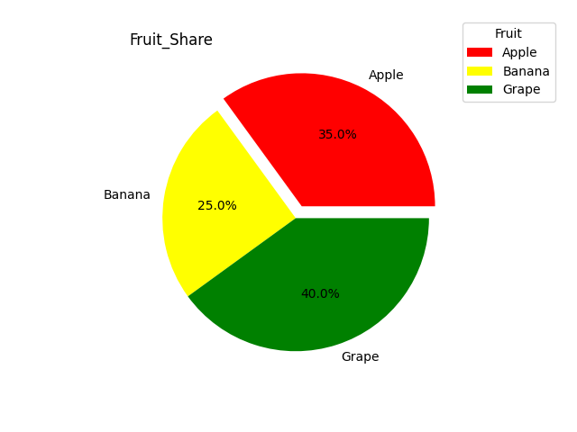
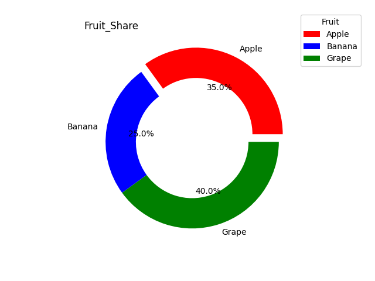
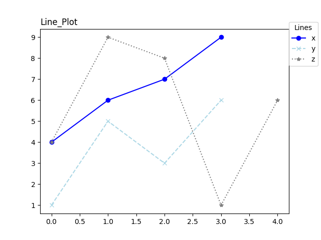

# `pymaid` : A `mermaid` inspired charting tool

`pymaid` is a simple charting tool which uses `matplotlib` to
plot charts. It enlace the user with a markdown like format
for creating quick plots. 

### Code Snippet
```Python
Pie
Apple 35
Banana 46
Grape 15
Mango 4
```
### Output:


### To Do
- [x] Line Plots
- [x] Pie Charts
- [ ] Scatter Plots
- [ ] Flowcharts
- [ ] Documentation (underway)
- [ ] GUI Application
- [ ] Comment Support

### Documentation
To use `pymaid` clone the repo and then create a `.pmd' file with the 
figure rules/syntax.
To get the figure run:
```Python
python3 main.py file.pmd
```

Some basic plot syntaxes:

#### Pie Chart
##### Syntax:
```Syntax
Pie Figure_Title(without spaces, optional) Legend_Title(without spaces, optional)
Label1 Percentage Color(optional) Explode (optional)
Label2 Percentage Color(optional) Explode (optional)
Label4 Percentage Color(optional) Explode (optional)
Label5 Percentage Color(optional) Explode (optional)
```

##### Example:
```pmd
Pie Fruit_Share Fruit
Apple 35 Red 0.1
Banana 25 Yellow
Grape 40 Green
```
##### Output:


#### Donut
##### Syntax:
```Syntax
Donut Figure_Title(without spaces, optional) Legend_Title(without spaces, optional)
Label1 Percentage Color (optional) Explode (optional) 
Label2 Percentage Color (optional) Explode (optional)
Label4 Percentage Color (optional) Explode (optional)
Label5 Percentage Color (optional) Explode (optional)
```

##### Example:
```pmd
Donut Fruit_Share Fruit
Apple 35 Red 0.1
Banana 25
Grape 40 Green
```
##### Output:


#### Line Plot
##### Syntax:
```Syntax
Line Figure_Title(without spaces, optional) Legend_Title(without spaces, optional)
Label1 Points(comma separated, without space) Marker(optional) Line-style(optional) Color(optional)

```

##### Example:
```pmd
Line Line_Plot Lines
x 4,6,7,9 o - Blue 
y 1,5,3,6 x -- Lightblue
z 4,9,8,1,6 * : Grey
```

##### Output:

